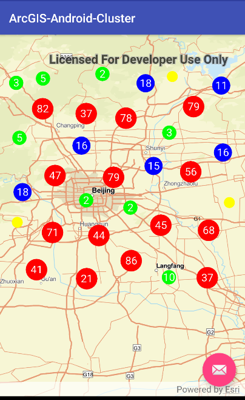
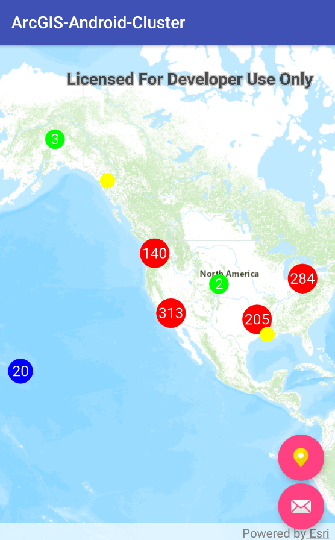

# ArcGIS-Android-Cluster
使用ArcGIS Runtime SDK for Android实现的点聚合。

## 版本要求
ArcGIS Runtime SDK for Android 100.1

## GraphicsOverlay效果图




## 生成随机点
```java
for (int i = 0; i < 1000; i++) {
    double lat = Math.random() + 39.474923;
    double lon = Math.random() + 116.027116;
    Point point = new Point(lon, lat, mMapView.getSpatialReference());
    Graphic gra = new Graphic(point, simpleMarkerSymbol);
    graphicsOverlay.getGraphics().add(gra);
}
```
## 地图比例尺变化
```java
mapView.addMapScaleChangedListener(new MapScaleChangedListener() {
    @Override
    public void mapScaleChanged(MapScaleChangedEvent mapScaleChangedEvent) {
        if (!mapView.isNavigating()) {
            //do you something
        }
    }
});
```

## 支持FeatureLayer



## FeatureLayer的查询
```java 
private void _clusterFeatures() {
    QueryParameters queryParameters = new QueryParameters();
    queryParameters.setGeometry(_mapView.getVisibleArea());
    queryParameters.setReturnGeometry(true);
    final ListenableFuture<FeatureQueryResult> futures =
            _featureLayer.getFeatureTable().queryFeaturesAsync(queryParameters);
    // add done loading listener to fire when the selection returns
    futures.addDoneListener(new Runnable() {
        @Override
         public void run() {
            try {
                //call get on the future to get the result
                FeatureQueryResult result = futures.get();
                // create an Iterator
                Iterator<Feature> iterator = result.iterator();
                Feature feature;
                // cycle through selections
                int counter = 0;
                while (iterator.hasNext()) {
                    feature = iterator.next();
                    _GraphicsOverlay.getGraphics().add(new Graphic(feature.getGeometry()));
                    counter++;
                }
                _clusterGraphics();
            } catch (Exception e) {
                Log.d("cluster", e.getLocalizedMessage());
            }
        }
    });
}
```
